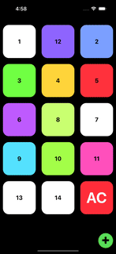

# member-collection




An application that allows user to scan, store and show their QR codes and bar codes. The user may arrange the order by drag & drop.

Tools used:

> Eslint, Husky, Context api, react-navigation, react-native-vision-camera, vison-camera-code-scanner, react-naive-wheel-color-picker, rn-qr-generator, react-addons-update

Key tech:

> PanResponder, Animated, Frame processor of camera

## Installation

```
yarn install
yarn prepare
cd ios
pod install
```

### No camera can be used in iOS simulator, please use the application in real device or android emulator.

## Testing

```
yarn jest
```

## Commit

if the following error occured during commit

```
.husky/pre-commit: line 4: yarn: command not found
```

run

```
yarn export-huskyrc
```
